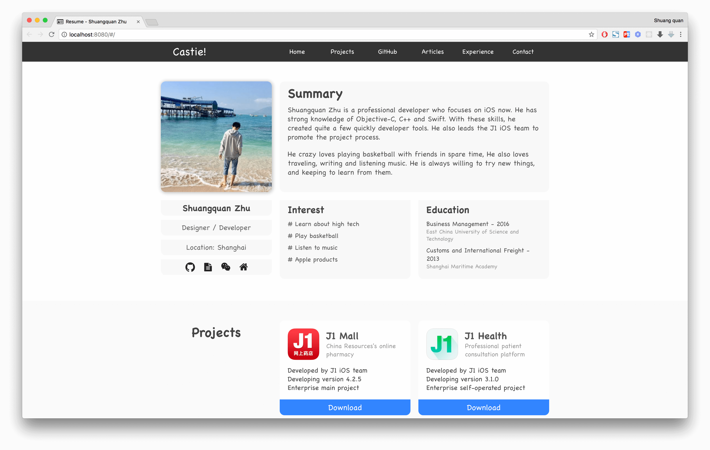
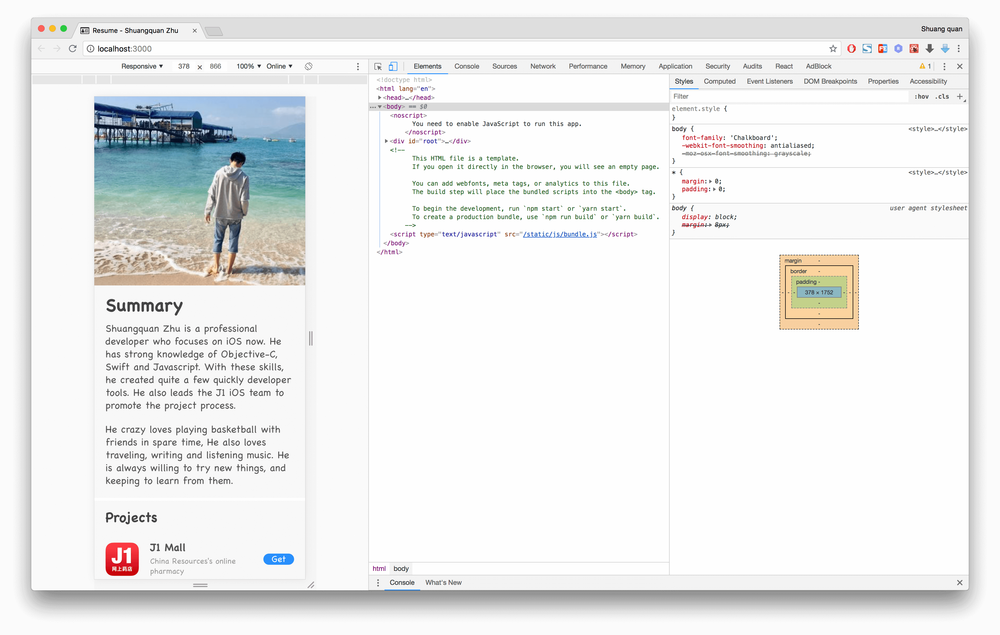
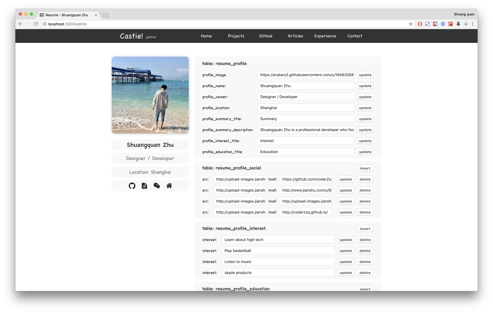

## Find inspiration in practice

### resume
> Practice a **web version** of resume, please **feel free** to connect me!

#### Get Started

- This part of project is base on the server, So you need to clone [resume for server](https://github.com/coderZsq/coderZsq.practice.server/tree/master/resume) 
- Then, you need a [node](https://nodejs.org/en/) server environment
- Last, run the following command to launch server

```
$ cd vue-resume
$ npm run dev
```
```
$ cd react-resume
$ npm start
```

#### Content

- **vue-resume:** **Static web pages** implemented using **vue** and deployed to **github-pages**.
- **react-resume:** **Responsive web pages** implemented using **react** and interact with the server.

#### Display





Now you can open the [website](https://coderzsq.github.io/coderZsq.practice.web/#/) directly to experience and contact me!

#### Artical

- [Web 是时候用前端写个简历了! / 2017 / 07](https://coderzsq.github.io/2017/07/Web-%E6%98%AF%E6%97%B6%E5%80%99%E7%94%A8%E5%89%8D%E7%AB%AF%E5%86%99%E4%B8%AA%E7%AE%80%E5%8E%86%E4%BA%86!/)
- [Web 前端项目要从基本布局开始 / 2017 / 07](https://coderzsq.github.io/2017/07/Web-%E5%89%8D%E7%AB%AF%E9%A1%B9%E7%9B%AE%E8%A6%81%E4%BB%8E%E5%9F%BA%E6%9C%AC%E5%B8%83%E5%B1%80%E5%BC%80%E5%A7%8B/)
- [Web 简历一定要设计的美美的 / 2017 / 07](https://coderzsq.github.io/2017/07/Web-%E7%AE%80%E5%8E%86%E4%B8%80%E5%AE%9A%E8%A6%81%E8%AE%BE%E8%AE%A1%E7%9A%84%E7%BE%8E%E7%BE%8E%E7%9A%84/)
- [Web 使用Vue代替陈旧的jQuery / 2017 / 07](https://coderzsq.github.io/2017/07/Web-%E4%BD%BF%E7%94%A8Vue%E4%BB%A3%E6%9B%BF%E9%99%88%E6%97%A7%E7%9A%84jQuery/)
- [Web Vue项目速转.htm静态网页 / 2017 / 07](https://coderzsq.github.io/2017/07/Web-Vue%E9%A1%B9%E7%9B%AE%E9%80%9F%E8%BD%AC.htm%E9%9D%99%E6%80%81%E7%BD%91%E9%A1%B5/)
- [Web 将项目快速迁移至React / 2017 / 09](https://coderzsq.github.io/2017/09/Web-%E5%B0%86%E9%A1%B9%E7%9B%AE%E5%BF%AB%E9%80%9F%E8%BF%81%E7%A7%BB%E8%87%B3React/)
- [Web PC项目快速适配移动端 / 2017 / 09](https://coderzsq.github.io/2017/09/Web-PC%E9%A1%B9%E7%9B%AE%E5%BF%AB%E9%80%9F%E9%80%82%E9%85%8D%E7%A7%BB%E5%8A%A8%E7%AB%AF/)
- [Web 使用fetch请求后端服务 / 2017 / 11](https://coderzsq.github.io/2017/11/Web-%E4%BD%BF%E7%94%A8fetch%E8%AF%B7%E6%B1%82%E5%90%8E%E7%AB%AF%E6%9C%8D%E5%8A%A1/)