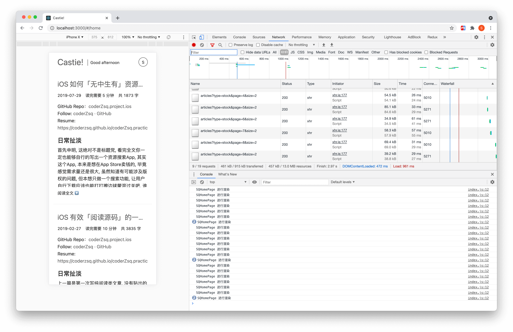
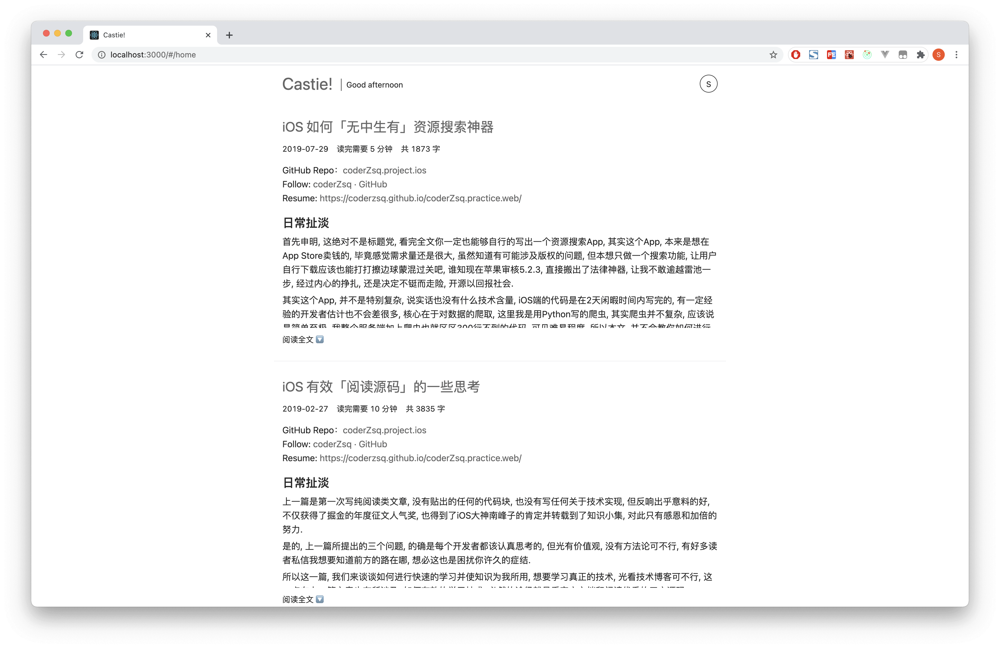
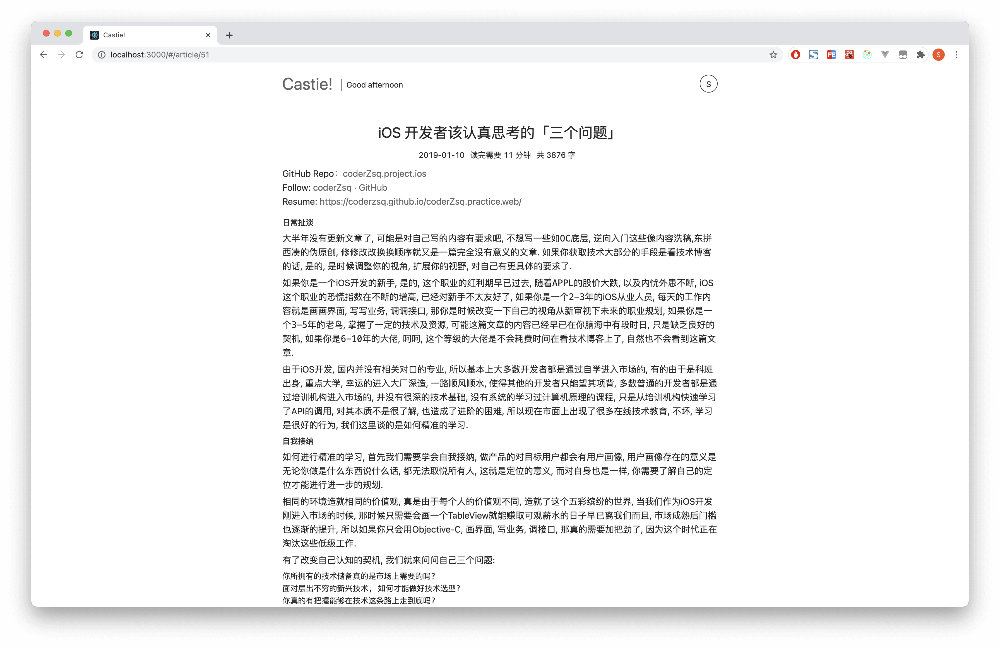
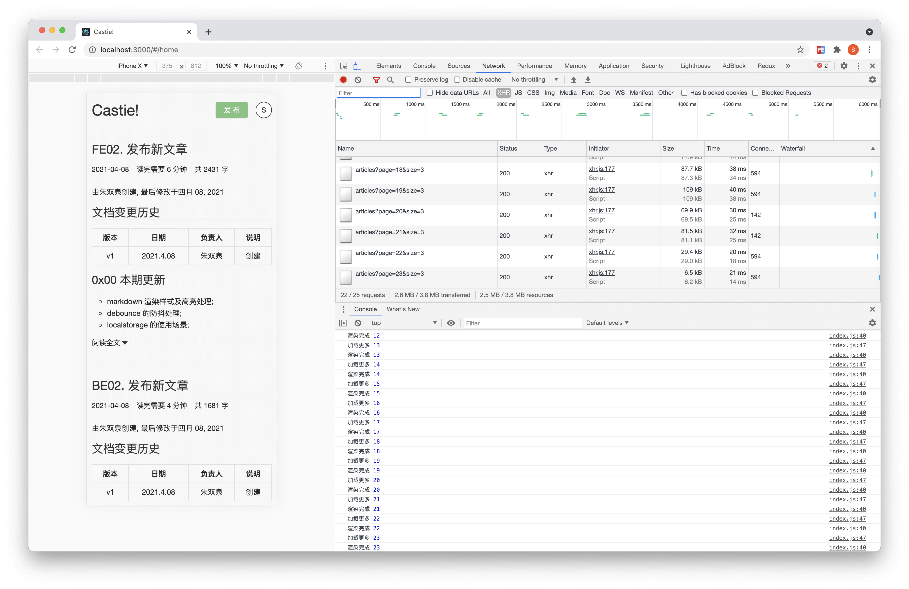

# FE01. 查看文章

由朱双泉创建, 最后修改于四月 09, 2021

## 文档变更历史

| 版本 |   日期    | 负责人 |       说明       |
| :--: | :-------: | :----: | :--------------: |
|  v1  | 2021.3.27 | 朱双泉 |       创建       |
|  v2  | 2021.4.09 | 朱双泉 | 解决多次渲染问题 |

## 0xFF 如何启动

1. [github](https://github.com/coderZsq) 下载 [coderZsq.product.doc](https://codeload.github.com/coderZsq/coderZsq.product.doc/zip/refs/heads/master) 仓库;
2. 解压 /02-技术文档/01-源代码/FE01-src.zip;
3. $ cd 进入 recoder 文件夹;
4. $ npm i 安装依赖库 (此步骤需要 node 环境);
5. $ npm run serve 将项目运行起来;
6. 会自动在浏览器访问 localhost:3000 端口显示;

## 0x00 环境搭建

- 使用 React 全家桶进行项目的搭建;
- 使用 Ant Design 作为 UI 的设计语言;
- 使用 JavaScript 作为主要的开发语言.

## 0x01 架构搭建

1. 先基于 React 脚手架搭建基础架构;
2. 具体集成及项相关架构搭建可以阅读[源码](https://github.com/coderZsq/coderZsq.practice.web/tree/master/recorder).

```
.
├── craco.config.js
├── package-lock.json
├── package.json
├── public
│   ├── favicon.ico
│   └── index.html
└── src
    ├── App.js
    ├── App.style.js
    ├── assets
    │   ├── css
    │   │   └── reset.css
    │   ├── font
    │   └── img
    ├── common
    │   ├── constants.js
    │   └── util
    │       ├── formats.js
    │       ├── hooks.js
    │       └── loadings.js
    ├── components
    │   ├── app-header
    │   │   ├── index.js
    │   │   └── style.js
    │   └── article
    │       ├── index.js
    │       └── style.js
    ├── index.js
    ├── pages
    │   ├── article
    │   │   ├── index.js
    │   │   ├── store
    │   │   │   ├── actionCreators.js
    │   │   │   ├── constants.js
    │   │   │   ├── index.js
    │   │   │   └── reducer.js
    │   │   └── style.js
    │   └── home
    │       └── index.js
    ├── router
    │   └── index.js
    ├── service
    │   ├── article.js
    │   ├── config.js
    │   └── request.js
    └── store
        ├── index.js
        └── reducer.js
```

## 0x02 响应式布局

- 使用媒体查询来进行响应式布局.

```less
margin: 0 auto;
width: 100%;
padding: 0 15px;
@media (min-width: 576px) {
  width: 90%;
}
@media (min-width: 768px) {
  width: 80%;
}
@media (min-width: 992px) {
  width: 70%;
}
@media (min-width: 1200px) {
  width: 60%;
}
@media (min-width: 1600px) {
  width: 50%;
}
```

## 0x03 样式搭建

CSS 小技巧:

- flex 交叉轴对齐时，可使用 margin 进行微调；
- 在 flex 的情况下 text-align 不起效果；

```less
display: flex;
justify-content: space-between;
align-items: center;

height: 65px;

.left {
  display: flex;
  align-items: center;

  .brand {
    text-align: center;

    font-size: 30px;
    width: 120px;
  }

  .greeting {
    text-align: center;

    border-left: 1px solid #333;
    margin-top: 4px;
    font-size: 14px;
    width: 120px;
  }
}

.right {
  text-align: center;

  width: 32px;
  height: 32px;
  line-height: 32px;
  margin-right: 15px;
  border-radius: 100%;
  border: 1px solid #333;
}
```

- 鼠标选中时的样式.

```less
::selection {
  color: #333;
  background-color: #ddd;
}
```

## 0x04 文章接口访问

- 对应单条和多条记录的接口访问.

```js
import request from './request';

export function getArticles(options) {
  const { type, page, size } = options;
  return request({
    url: '/articles',
    params: {
      type,
      page,
      size,
    },
  });
}

export function getArticle(id) {
  return request({
    url: '/articles',
    params: {
      id,
    },
  });
}
```

## 0x05 滚动加载

1. Ant-Design 的 [List](https://ant.design/components/list-cn/) 组件并不原生支持滚动加载;
2. 官方推荐使用 react-infinite-scroller 和 react-virtualized 均不支持 17 以上版本的 React;

```
npm ERR! code ERESOLVE
npm ERR! ERESOLVE unable to resolve dependency tree
npm ERR!
npm ERR! While resolving: recorder@0.1.0
npm ERR! Found: react@17.0.2
npm ERR! node_modules/react
npm ERR!   react@"^17.0.2" from the root project
npm ERR!
npm ERR! Could not resolve dependency:
npm ERR! peer react@"^15.3.0 || ^16.0.0-alpha" from react-virtualized@9.22.3
npm ERR! node_modules/react-virtualized
npm ERR!   react-virtualized@"*" from the root project
```

3. 可以通过传统方式监听 scroll 事件并结合自定义 hook 进行实现;

```js
useLoadMore(() => {
  setPage(page + 1);
});
```

4. 其中 const buffer = 800, 设置的是距离底部的缓冲值.

```js
export function useLoadMore(callback) {
  const [loading, setLoading] = useState(true);

  const onScroll = useCallback(() => {
    const buffer = 800;
    if (
      loading &&
      window.scrollY + document.body.clientHeight >=
        document.body.scrollHeight - buffer
    ) {
      setLoading(false);
      callback();
      setTimeout(() => {
        setLoading(true);
      }, 0);
    }
  }, [loading, callback]);

  useEffect(() => {
    document.addEventListener('scroll', onScroll);
    return () => {
      document.removeEventListener('scroll', onScroll);
    };
  }, [onScroll]);
}
```

## 0x06 React 碰到的坑

1. 页面通过路由跳转时, 由于是单页面应用, 会将滚动偏移值传递, 我们需要进行重置;

2. 为保持一致性, 同样使用自定义 hook 进行重置;

```js
export function useBackTop() {
  useEffect(() => {
    document.documentElement.scrollTop = 0;
  }, []);
}
```

3. 当页面没有请求到数据的时候 React 会渲染中间状态, 目前并没有很好的解决办法;


4. 该组件会进行多次渲染, 目前原因不明, 等待后续观察.



```jsx
export default memo(function SQHomePage() {
  console.log('SQHomePage 进行渲染');

  const [page, setPage] = useState(1);

  const { articles } = useSelector(
    (state) => ({
      articles: state.getIn(['article', 'articles']),
    }),
    shallowEqual
  );

  const dispatch = useDispatch();

  useEffect(() => {
    dispatch(
      getArticlesAction({
        type: 'stock',
        page,
        size: HOME_ARTICLES_SIZE,
      })
    );
  }, [dispatch, page]);

  useLoadMore(() => {
    setPage(page + 1);
  });

  return (
    <List
      dataSource={articles}
      renderItem={(item) => (
        <List.Item>
          <SQArticle
            key={item.id}
            id={item.id}
            title={item.title}
            words={item.words}
            duration={item.duration}
            date={item.date}
            content={item.content}
          />
        </List.Item>
      )}
    />
  );
});
```

5. 当前页面（组件）加载了足够多的数据， 进行路由跳转时再跳转回来会进行重新渲染， 但数据都用 redux 进行存储了， 一下子大规模的数据渲染会造成页面的卡顿, 类似 Keep-Alive 的方案听说可以解决, 但尝试后均失效;

## 0x07 性能优化

1. 每次请求只请求正好可以进行展示的数据;

```js
export const HOME_ARTICLES_SIZE = 2;
```

2. 如果请求的数据和当前的数据页数相同则避免重复请求;
3. 请求的页数控制在总页数内, 避免无效的请求;

```js
let curPage = -Infinity;
let totalPage = Infinity;
export const getArticlesAction = (options) => {
  return (dispatch) => {
    const { page, size } = options;
    if (curPage < page && page <= totalPage) {
      getArticles(options).then((res) => {
        curPage = page;
        totalPage = res.count / size;
        dispatch(changeArticlesAction(res));
      });
    }
  };
};
```

4. 每次在原数组的后面根据 size 进行累加;

```js
function reducer(state = defaultState, action) {
  switch (action.type) {
    case actionTypes.CHANGE_ARTICLES:
      return state.set(
        'articles',
        state.get('articles').concat(action.articles)
      );
    case actionTypes.CHANGE_ARTICLE:
      return state.set('article', action.article);
    default:
      return state;
  }
}
```

5. 由于 markdown 的内容会随着数据量大幅增大, 会造成 0x06 节的第 5 条坑, 虽然目前没有很好的解决方案, 但使用 content.slice(0, 850), 对折叠字符串进行截取, 降低渲染数据是目前的主要手段.

```jsx
export default memo(function SQArticle(props) {
  const { id, title, duration, words, date, content } = props;
  const [collapse, setCollapse] = useState(true);

  return (
    <SQArticleWrapper>
      <NavLink to={'article/' + id}>
        <div className="title">{title}</div>
      </NavLink>
      <div className="info">
        <div className="item date">{formatDate(date, 'yyyy-MM-dd')}</div>
        <div className="item duration">读完需要 {duration} 分钟</div>
        <div className="item words">共 {words} 字</div>
      </div>
      <div
        className={`content ${collapse ? 'collapse' : ''}`}
        dangerouslySetInnerHTML={{
          __html: marked(collapse ? content.slice(0, 850) : content),
        }}
      ></div>
      <div className="read-all" onClick={() => setCollapse(false)}>
        <span>{collapse ? '阅读全文 🔽' : ''}</span>
      </div>
    </SQArticleWrapper>
  );
});
```

## 0x08 成品展示




## 0x09 解决多次渲染问题

- hooks.js
  这是对 React 的渲染机制不熟练导致的, 自定义 hook 中的每一个 useState 被触发都会进行一次渲染, 这会导致在滚动的时候进行频繁的渲染操作, 故导致卡顿等一系列的问题, 如果不是状态字段是不需要使用 useState 来存储的, 使用 useRef 即可达到效果.

```js
export function useLoadMore(callback) {
  const loadingRef = useRef(true);
  const onScroll = useCallback(() => {
    const buffer = 300;
    if (
      loadingRef.current &&
      window.scrollY + document.body.clientHeight >=
        document.body.scrollHeight - buffer
    ) {
      loadingRef.current = false;
      callback();
      setTimeout(() => {
        loadingRef.current = true;
      }, 0);
    }
  }, [callback]);

  useEffect(() => {
    document.addEventListener('scroll', onScroll);
    return () => {
      document.removeEventListener('scroll', onScroll);
    };
  }, [onScroll]);
}
```

- home.js
  判断前置, 进行渲染的拦截, 之前的 current 算法有点小 bug, 现已修复, 但是每次还是会渲染两次, 原因不明待观察, 初步猜测可能是 useEffect 导致的.

```js
export default memo(function SQHomePage() {
  const [page, setPage] = useState(1);
  const renderedRef = useRef(false);

  const { articles } = useSelector(
    (state) => ({
      articles: state.getIn(['article', 'articles']),
    }),
    shallowEqual
  );

  let totalPage = useRef(-Infinity);
  const dispatch = useDispatch();

  useEffect(() => {
    renderedRef.current = true;
    dispatch(
      getArticlesAction(
        {
          page,
          size: HOME_ARTICLES_SIZE,
        },
        (count) => {
          totalPage.current = Math.floor((count - 1) / HOME_ARTICLES_SIZE) + 1;
        }
      )
    );
  }, [dispatch, page]);

  useLoadMore(() => {
    if (page < totalPage.current && renderedRef.current) {
      renderedRef.current = false;
      setPage(page + 1);
    }
  });
  ...
}
```


