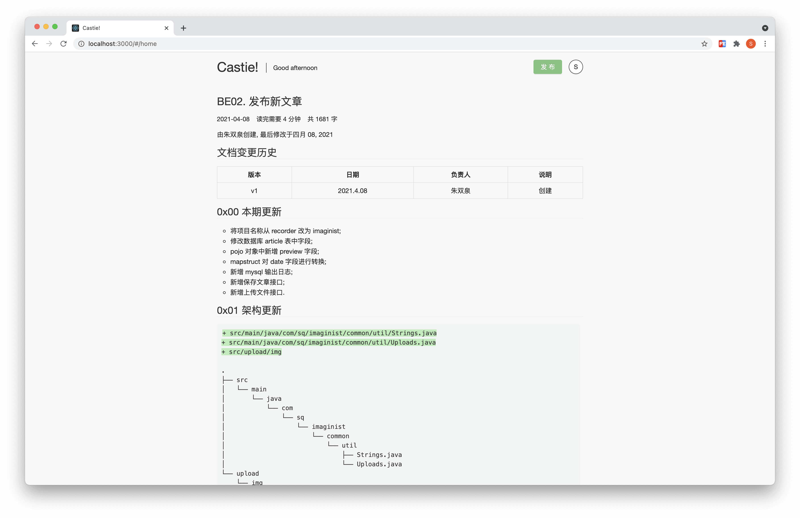
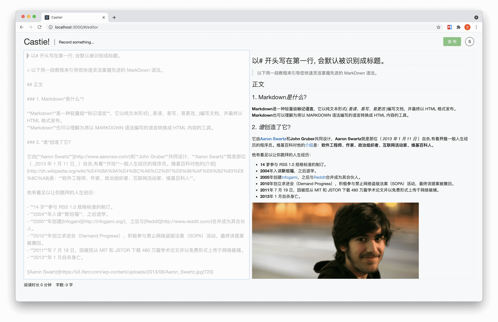

# FE02. 发布文章

由朱双泉创建, 最后修改于四月 08, 2021

## 文档变更历史

| 版本 |   日期    | 负责人 |   说明   |
| :--: | :-------: | :----: | :------: |
|  v1  | 2021.4.08 | 朱双泉 |   创建   |
|  v2  | 2021.4.11 | 朱双泉 | 代码调优 |
|  v3  | 2021.4.18 | 朱双泉 | 增强拖拽 |

## 0xFF 如何启动

1. [github](https://github.com/coderZsq) 下载 [coderZsq.product.doc](https://codeload.github.com/coderZsq/coderZsq.product.doc/zip/refs/heads/master) 仓库;
2. 解压 /02-技术文档/01-源代码/FE02-src.zip;
3. $ cd 进入 imaginist 文件夹;
4. $ npm i 安装依赖库 (此步骤需要 node 环境);
5. $ node ./src/test/article.test.js 载入预览md;
6. $ npm run serve 将项目运行起来;
7. 会自动在浏览器访问 localhost:3000 端口显示;

## 0x00 本期更新

- markdown 渲染样式及高亮处理;
- debounce 的防抖处理;
- localstorage 的使用场景;
- 光标处插入的方法;
- 同步滚动的实现;
- 拖拽上传的注意事项;

## 0x01 架构更新

```diff
- src/App.style.js
- src/pages/article/store
+ src/common/util/cursors.js
+ src/common/util/storages.js
+ src/common/util/strings.js
+ src/pages/editor
+ src/pages/home/style.js
+ src/store/article
+ src/style
+ src/test

.
└── src
    ├── common
    │   └── util
    │       ├── cursors.js
    │       ├── storages.js
    │       └── strings.js
    ├── pages
    │   ├── editor
    │   │   ├── index.js
    │   │   └── style.js
    │   └── home
    │       └── style.js
    ├── store
    │   └── article
    │       ├── actionCreators.js
    │       ├── constants.js
    │       ├── index.js
    │       └── reducer.js
    ├── style
    │   ├── layout.style.js
    │   └── markdown.style.js
    └── test
        ├── article.sql
        ├── article.test.js
        ├── database.js
        └── test.js
```

## 0x02 markdown 样式

1. 全局配置 marked 并引入 highlight.js 实现代码高亮;

```js
marked.setOptions({
  renderer: new marked.Renderer(),
  highlight: function (code, language) {
    const hljs = require('highlight.js');
    return hljs.highlight(code, {
      language: hljs.getLanguage(language) ? language : 'plaintext',
    }).value;
  },
  pedantic: false,
  gfm: true,
  breaks: false,
  sanitize: false,
  smartLists: true,
  smartypants: false,
  xhtml: false,
});
```

2. markdown 使用 GitHub 样式, code 使用 Xcode 样式;

```css
a,
p,
img {
  max-width: 100%;
}

pre {
  display: block;
  border-radius: 4px;
  background: #f3f4f4;
  color: #333;
  font-family: Menlo, Monaco, Consolas, monospace;
  line-height: 1.5;
  padding: 10px;
  box-shadow: 1px 1px 3px #eee;
  width: 99%;
}

/*

XCode style (c) Angel Garcia <angelgarcia.mail@gmail.com>

*/

.hljs {
  display: block;
  overflow-x: auto;
  padding: 0.5em;
  background: #fff;
  color: black;
}

/* Gray DOCTYPE selectors like WebKit */
.xml .hljs-meta {
  color: #c0c0c0;
}

.hljs-comment,
.hljs-quote {
  color: #007400;
}

.hljs-tag,
.hljs-attribute,
.hljs-keyword,
.hljs-selector-tag,
.hljs-literal,
.hljs-name {
  color: #aa0d91;
}

.hljs-variable,
.hljs-template-variable {
  color: #3f6e74;
}

.hljs-code,
.hljs-string,
.hljs-meta-string {
  color: #c41a16;
}

.hljs-regexp,
.hljs-link {
  color: #0e0eff;
}

.hljs-title,
.hljs-symbol,
.hljs-bullet,
.hljs-number {
  color: #1c00cf;
}

.hljs-section,
.hljs-meta {
  color: #643820;
}

.hljs-class .hljs-title,
.hljs-type,
.hljs-built_in,
.hljs-builtin-name,
.hljs-params {
  color: #5c2699;
}

.hljs-attr {
  color: #836c28;
}

.hljs-subst {
  color: #000;
}

.hljs-formula {
  background-color: #eee;
  font-style: italic;
}

.hljs-addition {
  background-color: #baeeba;
}

.hljs-deletion {
  background-color: #ffc8bd;
}

.hljs-selector-id,
.hljs-selector-class {
  color: #9b703f;
}

.hljs-doctag,
.hljs-strong {
  font-weight: bold;
}

.hljs-emphasis {
  font-style: italic;
}

body {
  color: rgb(51, 51, 51);
  line-height: 1.6;
}

a {
  color: #4183c4;
}
h1,
h2,
h3,
h4,
h5,
h6 {
  position: relative;
  margin-top: 1rem;
  margin-bottom: 1rem;
  font-weight: 400;
  line-height: 1.4;
  cursor: text;
  color: #333;
}
h1:hover a.anchor,
h2:hover a.anchor,
h3:hover a.anchor,
h4:hover a.anchor,
h5:hover a.anchor,
h6:hover a.anchor {
  text-decoration: none;
}
h1 tt,
h1 code {
  font-size: inherit;
}
h2 tt,
h2 code {
  font-size: inherit;
}
h3 tt,
h3 code {
  font-size: inherit;
}
h4 tt,
h4 code {
  font-size: inherit;
}
h5 tt,
h5 code {
  font-size: inherit;
}
h6 tt,
h6 code {
  font-size: inherit;
}
h1 {
  font-size: 1.8em;
  line-height: 1.2;
  border-bottom: 1px solid #eee;
}
h2 {
  font-size: 1.6em;
  line-height: 1.225;
  border-bottom: 1px solid #eee;
}

h3 {
  font-size: 1.5em;
  line-height: 1.43;
}
h4 {
  font-size: 1.4em;
}
h5 {
  font-size: 1.3em;
}
h6 {
  font-size: 1.2em;
  color: #777;
}
p,
blockquote,
ul,
ol,
dl,
table {
  font-size: 1.05em;
  margin: 0.8em 0;
}

em {
  font-style: italic;
}

ul,
ol,
li {
}

li > ol,
li > ul {
  margin: 0 0;
}
hr {
  height: 2px;
  padding: 0;
  margin: 16px 0;
  background-color: #e7e7e7;
  border: 0 none;
  overflow: hidden;
  box-sizing: content-box;
}

li p.first {
  display: inline-block;
}
ul,
ol {
  padding-left: 30px;
}
ul:first-child,
ol:first-child {
  margin-top: 0;
}
ul:last-child,
ol:last-child {
  margin-bottom: 0;
}
blockquote {
  border-left: 4px solid #dfe2e5;
  padding: 0 15px;
  color: #777777;
}
blockquote blockquote {
  padding-right: 0;
}
table {
  padding: 0;
  word-break: initial;
  width: 100%;
}
table tr {
  border-top: 1px solid #dfe2e5;
  margin: 0;
  padding: 0;
}
table tr:nth-child(2n),
thead {
  background-color: #f8f8f8;
}
table th {
  font-weight: bold;
  border: 1px solid #dfe2e5;
  border-bottom: 0;
  margin: 0;
  padding: 6px 13px;
  text-align: center;
}
table td {
  border: 1px solid #dfe2e5;
  margin: 0;
  padding: 6px 13px;
}
table th:first-child,
table td:first-child {
  margin-top: 0;
}
table th:last-child,
table td:last-child {
  margin-bottom: 0;
}

code,
tt {
  border-radius: 3px;
  padding: 0;
  padding: 2px 4px 0px 4px;
  font-size: 1em;
}

code {
  background-color: #f3f4f4;
  padding: 0 2px 0 2px;
}

.md-mathjax-midline {
  background: #fafafa;
}

/** focus mode */
.on-focus-mode blockquote {
  border-left-color: rgba(85, 85, 85, 0.12);
}

header,
footer {
  font-family: 'Segoe UI', 'Arial', sans-serif;
}
```

## 0x03 编辑区

1. 文字的标题截取, 第一行的文字默认截取存储为标题字段;

```js
title: /#{0,}(.*)/.exec(edit.slice(0, split))[1].trim(),
```

2. debounce 防抖, 监听用户输入时 marked 实时渲染会造成卡顿使用防抖处理;

```js
const onChange = (e) => {
  setEditContent(e.target.value);
  _.debounce(() => {
    setPreviewContent(marked(e.target.value));
  }, 0)();
};
```

3. localstroage 缓存, 渲染时读取, 离开时保存, 提交时清除;

```js
export function getLocalStorage(key) {
  return JSON.parse(window.localStorage.getItem(key));
}

export function setLocalStorage(key, value) {
  window.localStorage.setItem(key, JSON.stringify(value));
}

export function removeLocalStorage(key) {
  window.localStorage.removeItem(key);
}
```

4. placeholder 占位文字展示 markdown 的用法, 全文去源码查看;

```js
export const MARKDOWN_PLACEHOLDER =
  '# 以# 开头写在第一行, 会默认被识别成标题。\n' +
  '\n' +
  '> 以下用一段教程来引导您快速灵活掌握先进的 MarkDown 语法。\n' +
  '\n' +
  '## 正文\n' +
  '\n' +
  '### 1. Markdown*是什么*？\n' +
  '\n' +
  '**Markdown**是一种轻量级**标记语言**，它以纯文本形式( _易读、易写、易更改_ )编写文档，并最终以 HTML 格式发布。  \n' +
  '**Markdown**也可以理解为将以 MARKDOWN 语法编写的语言转换成 HTML 内容的工具。\n' +
  '\n' +
  '### 2. *谁*创造了它？\n' +
  '\n' +
  '它由[**Aaron Swartz**](http://www.aaronsw.com/)和**John Gruber**共同设计，**Aaron Swartz**就是那位（ _2013 年 1 月 11 日_ ）自杀,有着**开挂**一般人生经历的程序员。维基百科对他的[介绍](http://zh.wikipedia.org/wiki/%E4%BA%9A%E4%BC%A6%C2%B7%E6%96%AF%E6%B2%83%E8%8C%A8)是：**软件工程师、作家、政治组织者、互联网活动家、维基百科人**。\n' +
  '\n' +
  '他有着足以让你跪拜的人生经历：\n' +
  '\n' +
  '- **14 岁**参与 RSS 1.0 规格标准的制订。\n' +
  '- **2004**年入读**斯坦福**，之后退学。\n' +
  '- **2005**年创建[Infogami](http://infogami.org/)，之后与[Reddit](http://www.reddit.com/)合并成为其合伙人。\n' +
  '- **2010**年创立求进会（Demand Progress），积极参与禁止网络盗版法案（SOPA）活动，最终该提案被撤回。\n' +
  '- **2011**年 7 月 19 日，因被控从 MIT 和 JSTOR 下载 480 万篇学术论文并以免费形式上传于网络被捕。\n' +
  '- **2013**年 1 月自杀身亡。\n' +
  '\n' +
  '\n' +
  '\n' +
  '天才都有早逝的归途。\n' +
  '\n' +
  ...
```

5. 有几率存在回车时跳动的问题, 日后观察.

## 0x04 存储预览 html

- 将预览区的 html 存入数据库, 以后直接渲染 html, 无需再 marked, 提高性能

1. 链接数据库, 这里使用 mysql2;

```js
const mysql = require('mysql2');

const connections = mysql.createPool({
  host: 'localhost',
  port: 3306,
  database: 'imaginist',
  user: 'root',
  password: 'root',
});

connections.getConnection((err, conn) => {
  conn.connect((err) => {
    if (err) {
      console.log('连接失败: ', err);
    } else {
      console.log('数据库连接成功~');
    }
  });
});

module.exports = connections.promise();
```

2. 将之前 62 篇文章的 html 存入数据库.

```js
const connection = require('./database.js');
const marked = require('marked');

marked.setOptions({
  renderer: new marked.Renderer(),
  highlight: function (code) {
    const hljs = require('highlight.js');
    return hljs.highlightAuto(code).value;
  },
  pedantic: false,
  gfm: true,
  breaks: false,
  sanitize: false,
  smartLists: true,
  smartypants: false,
  xhtml: false,
});

(async function saveStockPreviewColumn() {
  let statement = `SELECT id, content FROM article`;
  const [result] = await connection.execute(statement);
  const previews = result.map((article) => {
    return {
      id: article.id,
      preview: marked(article.content),
    };
  });
  for (let item of previews) {
    statement = `UPDATE article SET preview = ? WHERE id = ${item.id}`;
    console.log(statement);
    await connection.execute(statement, [item.preview]);
  }
})();
```

## 0x05 同步滚动

- 经测试, 此同步滚动方案在 firefox 有 bug, 编辑区在 placeholder 状态下会假死, 可能是 Ant-Design 的 Input.TextArea 造成的, 有待观察.

```js
const onScroll = () => {
  const edit = editRef.current.resizableTextArea.textArea;
  const preview = previewRef.current;
  edit.addEventListener('scroll', () => {
    const percentage = edit.scrollTop / (edit.scrollHeight - edit.offsetHeight);
    const height = percentage * (preview.scrollHeight - preview.offsetHeight);
    preview.scrollTop = height;
  });
};
```

## 0x06 发布文章

1. js 字数计算

```js
export const wordCount = (string) => {
  const pattern = /[a-zA-Z0-9_\u0392-\u03c9]+|[\u4E00-\u9FFF\u3400-\u4dbf\uf900-\ufaff\u3040-\u309f\uac00-\ud7af]+/g;
  const m = string.match(pattern);
  let count = 0;
  if (m == null) {
    return count;
  }
  for (let i = 0; i < m.length; i++) {
    if (m[i].charCodeAt(0) >= 0x4e00) {
      count += m[i].length;
    } else {
      count += 1;
    }
  }
  return count;
};
```

2. 请求发布文章接口;

```js
export function setArticle(options) {
  const { id, title, type, content, preview, words, duration, date } = options;
  return request({
    url: '/articles/save',
    data: {
      id,
      title,
      type,
      content,
      preview,
      words,
      duration,
      date,
    },
    method: 'post',
  });
}
```

3. 设置合适的请求头, axios 原生 post 请求为 raw 值, 需要做以下更改;

```js
instance.interceptors.request.use(
  (config) => {
    if (
      config.headers['Content-Type'] === 'application/x-www-form-urlencoded'
    ) {
      config.data = qs.stringify(config.data);
    }
    return config;
  },
  (error) => Promise.error(error)
);
```

4. 对文字进行校验并发送请求.

```js
const onConfirm = () => {
  if (editContent.length === 0) {
    message.error('您还没有写任何文字呢~');
    return;
  }
  if (editContent.indexOf('\n') < 0) {
    message.error('请您尝试再多写点文字吧~');
    return;
  }
  const edit = editContent;
  let split = 0;
  for (let i = 0; i < edit.length; i++) {
    if (edit.charAt(i) === '\n') {
      split = i;
      break;
    }
  }
  const option = {
    title: /#{0,}(.*)/.exec(edit.slice(0, split))[1].trim(),
    type: 'doc',
    content: editContent,
    preview: marked(edit.slice(split + 1)),
    words: wordCount(editContent),
    duration: parseInt(wordCount(editContent) / 350),
    date: new Date().getTime(),
  };

  message.loading({ content: '发布文章中...', key: 'publish' });
  setArticle(option).then((res) => {
    props.history.push(`/article/${res.data}`);
    message.success({ content: '发布完成~', key: 'publish', duration: 2 });
    setTimeout(() => {
      removeLocalStorage(EDITOR_EDIT_STORAGE);
      removeLocalStorage(EDITOR_PREVIEW_STORAGE);
    }, 1000);
  });
};
```

## 0x07 上传图片

1. 使用第三方拖拽库;

```shell
$npm i react-dropzone -S
```

```jsx
<Dropzone onDrop={onDrop}>
  {({ getRootProps }) => (
    <Input.TextArea
      {...getRootProps()}
      ref={editRef}
      autoFocus={true}
      className="item edit"
      onChange={onChange}
      value={editContent}
      placeholder={MARKDOWN_PLACEHOLDER}
    ></Input.TextArea>
  )}
</Dropzone>
```

2. 请求上传图片接口;

```js
export function uploadImg(options) {
  const { img } = options;
  const data = new FormData();
  data.append('img', img);
  return request({
    headers: { 'Content-Type': 'multipart/form-data' },
    url: '/articles/uploadImg',
    data: data,
    method: 'post',
  });
}
```

3. 光标处插入;

```js
export const setCursorPosition = (ctrl, pos) => {
  //设置光标位置函数
  if (ctrl.setSelectionRange) {
    //非ie
    ctrl.focus(); // 获取焦点
    ctrl.setSelectionRange(pos, pos); // 设置选定区的开始和结束点
  } else if (ctrl.createTextRange) {
    var range = ctrl.createTextRange(); // 创建选定区
    range.collapse(true); // 设置为折叠,即光标起点和结束点重叠在一起
    range.moveEnd('character', pos); // 移动结束点
    range.moveStart('character', pos); // 移动开始点
    range.select(); // 选定当前区域
  }
};

export const getCursorPosition = (ctrl) => {
  var CaretPos = 0;
  // IE Support
  if (document.selection) {
    ctrl.focus(); // 获取焦点
    var Sel = document.selection.createRange(); // 创建选定区域
    Sel.moveStart('character', -ctrl.value.length); // 移动开始点到最左边位置
    CaretPos = Sel.text.length; // 获取当前选定区的文本内容长度
  }
  // Firefox support (非ie)
  else if (ctrl.selectionStart || ctrl.selectionStart === '0') {
    CaretPos = ctrl.selectionStart; // 获取选定区的开始点
  }
  return CaretPos;
};
```

4. 拖拽样式响应;

```js
const onDragOver = () => {
  const edit = editRef.current.resizableTextArea.textArea;
  const dragleaveCSS = edit.className;
  const dragoverCSS = edit.className + ' dragover';
  edit.addEventListener('dragover', () => {
    edit.className = dragoverCSS;
    edit.addEventListener('dragleave', () => {
      edit.className = dragleaveCSS;
    });
    edit.addEventListener('drop', () => {
      edit.className = dragleaveCSS;
    });
  });
};
```

5. 进行上传;

```js
const onDrop = (acceptedFiles) => {
  const img = acceptedFiles[0];
  if (!/image\/\w+/.test(img.type)) {
    message.error('拖拽上传只支持图片呢~');
    return false;
  }
  uploadImg({ img }).then((res) => {
    let p = getCursorPosition(editRef.current.resizableTextArea.textArea);
    const content = `${editContent.slice(0, p)}${editContent.slice(p)}`;
    setEditContent(content);
    setPreviewContent(marked(content));
  });
};
```

6. 本来想实现自动定位光标位置, 但尝试一番未能实现, 日后观察.

## 0x08 成品展示




## 0x09 代码调优

1. 合并 useState, 去掉\_debounce 函数;

```js
export default memo(function SQEditorPage(props) {
  const [content, setContent] = useState({
    edit: getLocalStorage(EDITOR_STORAGE).edit || '',
    preview: getLocalStorage(EDITOR_STORAGE).preview || '',
  });
  ...
  const onChange = (e) => {
    setContent({
      edit: e.target.value,
      preview: marked(e.target.value),
    });
  };

  const onDrop = (acceptedFiles) => {
    ...
    uploadImg({ img }).then((res) => {
      ...
      setContent({
        edit: edit,
        preview: marked(edit),
      });
    });
  };
```

2. 合并 localstorage, 使用一个存储单元;

```js
...
import { EDITOR_STORAGE } from '@/common/constants';
...
export default memo(function SQEditorPage(props) {
  const [content, setContent] = useState({
    edit: getLocalStorage(EDITOR_STORAGE).edit || '',
    preview: getLocalStorage(EDITOR_STORAGE).preview || '',
  });
  ...
  useEffect(() => {
    ...
    return () => {
      setLocalStorage(EDITOR_STORAGE, {
        edit: content.edit,
        preview: content.preview,
      });
    };
  }, [content]);
  ...
  const onConfirm = () => {
    ...
    setArticle(option).then((res) => {
      ...
      removeLocalStorage(EDITOR_STORAGE);
    });
  };
```

3. 获取为空时返回空对象, 不然访问属性会报错;

```js
export function getLocalStorage(key) {
  return JSON.parse(window.localStorage.getItem(key)) || {};
}
```

4. 新增 markdown 拖拽输入功能;

- 将图片拖拽至编辑区, 则按照光标位置插入;
- 将 md 拖拽至编辑区, 则会将 md 内容在编辑区显示;

```js
const onDrop = (acceptedFiles) => {
  const file = acceptedFiles[0];
  if (/text\/markdown/.test(file.type)) {
    const reader = new FileReader();
    reader.onload = (e) => {
      setContent({
        edit: e.target.result,
        preview: marked(e.target.result),
      });
    };
    reader.readAsText(file);
    return;
  }
  if (/image\/\w+/.test(file.type)) {
    uploadImg({ img: file }).then((res) => {
      let p = getCursorPosition(editRef.current.resizableTextArea.textArea);
      const edit = `${content.edit.slice(0, p)}${content.edit.slice(p)}`;
      setContent({
        edit: edit,
        preview: marked(edit),
      });
    });
    return;
  }
};
```

## 0x0A 增强拖拽功能

1. 使用 axios 进行并发请求;

```js
const batch = (requests, callback) => {
  axios.all(requests).then(axios.spread(callback));
};
```

2. 新增读取逻辑, 将编辑好的 md 和内联图片拖拽至编辑区, 则自动上传图片后一并渲染到预览区;

```js
const onDrop = (acceptedFiles) => {
  let mdFile = null;
  let imgPaths = [];
  let requests = [];
  for (let file of acceptedFiles) {
    if ('' === file.type) {
      mdFile = file;
    }
    if (/image\/\w+/.test(file.type)) {
      let co = file.path.split('/').reverse();
      imgPaths.push(`${co[1]}/${co[0]}`);
      requests.push(uploadImg({ img: file }));
    }
  }

  const file = acceptedFiles[0];
  if (imgPaths.length === 0) {
    ...
  } else if (mdFile === null) {
    ...
  } else {
    batch(requests, (...res) => {
      const reader = new FileReader();
      reader.readAsText(mdFile);
      reader.onload = (e) => {
        let edit = e.target.result;
        for (let i = 0; i < imgPaths.length; i++) {
          edit = edit.replace(`./${imgPaths[i]}`, `${BASE_URL}/${res[i].data}`);
          edit = edit.replace(`${imgPaths[i]}`, `${BASE_URL}/${res[i].data}`);
        }
        setContent({
          edit: edit,
          preview: marked(edit),
        });
      };
    });
  }
};
```
