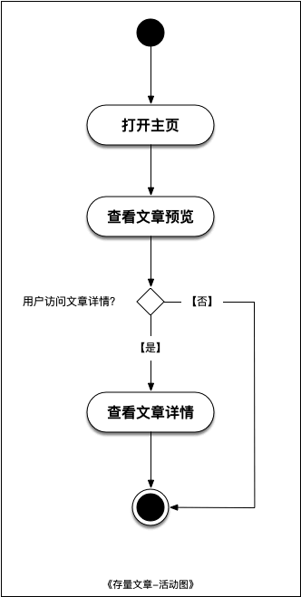
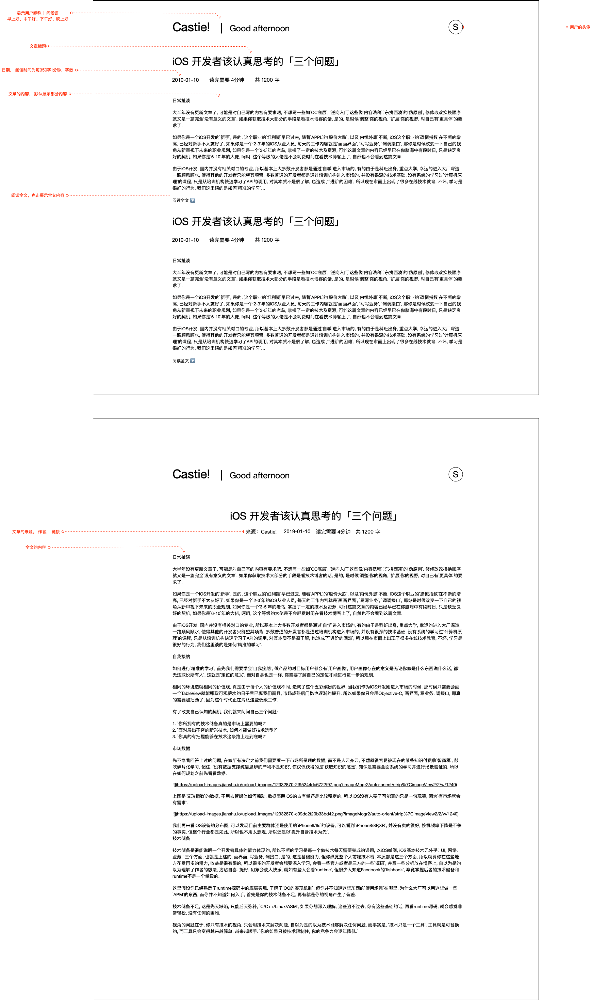

# UC01. 查看文章

由朱双泉创建, 最后修改于三月 19, 2021

## 文档变更历史

| 版本 |   日期    | 负责人 | 说明 |
| :--: | :-------: | :----: | :--: |
|  v1  | 2021.3.19 | 朱双泉 | 创建 |

## 用例描述

本文档描述用户进入网站查看文章

## 角色

- 用户

## 状态图

- 无

## 活动图

## 原型图

## 基本流程

1. 用例开始
2. 用户向系统发起访问主站的请求
3. 系统展示主站列表界面
4. 用户点击文章标题向系统请求单条文章
5. 系统展示文章详细内容界面
6. 用例结束

## 扩展流程

- 4a. 用户点击阅读单篇文章全文按钮
  - 4a1. 系统展示该篇文章的全文内容
  - 4a2. 执行用例 6
- 4a. 用户不做任何操作
  - 4a2. 执行用例 6
