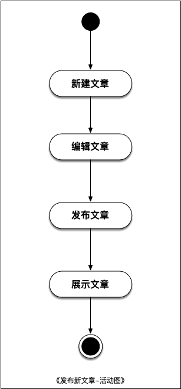
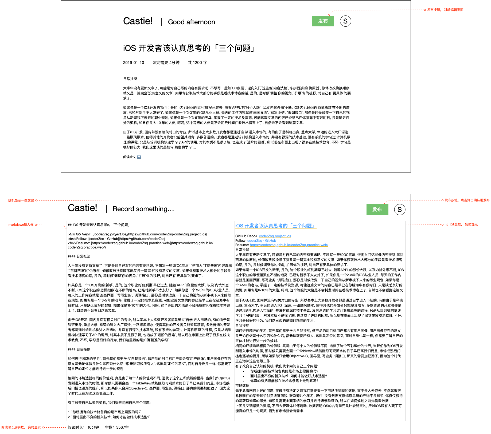

# UC02. 发布文章

## 文档变更历史

| 版本 |   日期    | 负责人 |   说明   |
| :--: | :-------: | :----: | :------: |
|  v1  | 2021.3.28 | 朱双泉 |   创建   |
|  v2  | 2021.4.11 | 朱双泉 | 新增备注 |

## 用例描述

本文档描述用户发布文章的流程

## 角色

- 用户

## 状态图

- 无

## 活动图

## 原型图

## 基本流程

1. 用例开始
2. 用户向系统发起发布新文章的请求
3. 系统展示文章编辑的界面
4. 用户在界面中编写.md 文字
5. 用户进行文章的发布
6. 系统弹出确认对话框
7. 用户进行发布确认
8. 系统跳转该篇文章的文章详情页
9. 用例结束

## 扩展流程

- 7a. 用户进行取消
  - 7a1 执行用例 4

## 备注

1. 编辑区预览区同步滚动;
2. 编辑区支持拖拽图片上传;
3. 编辑区支持拖拽.md 文件读取;
