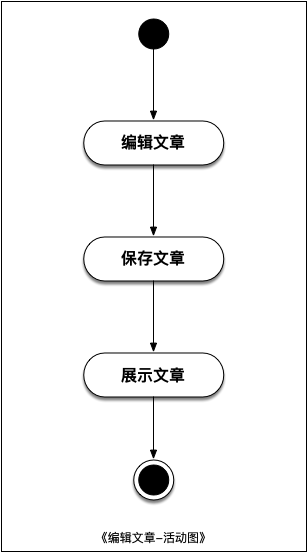
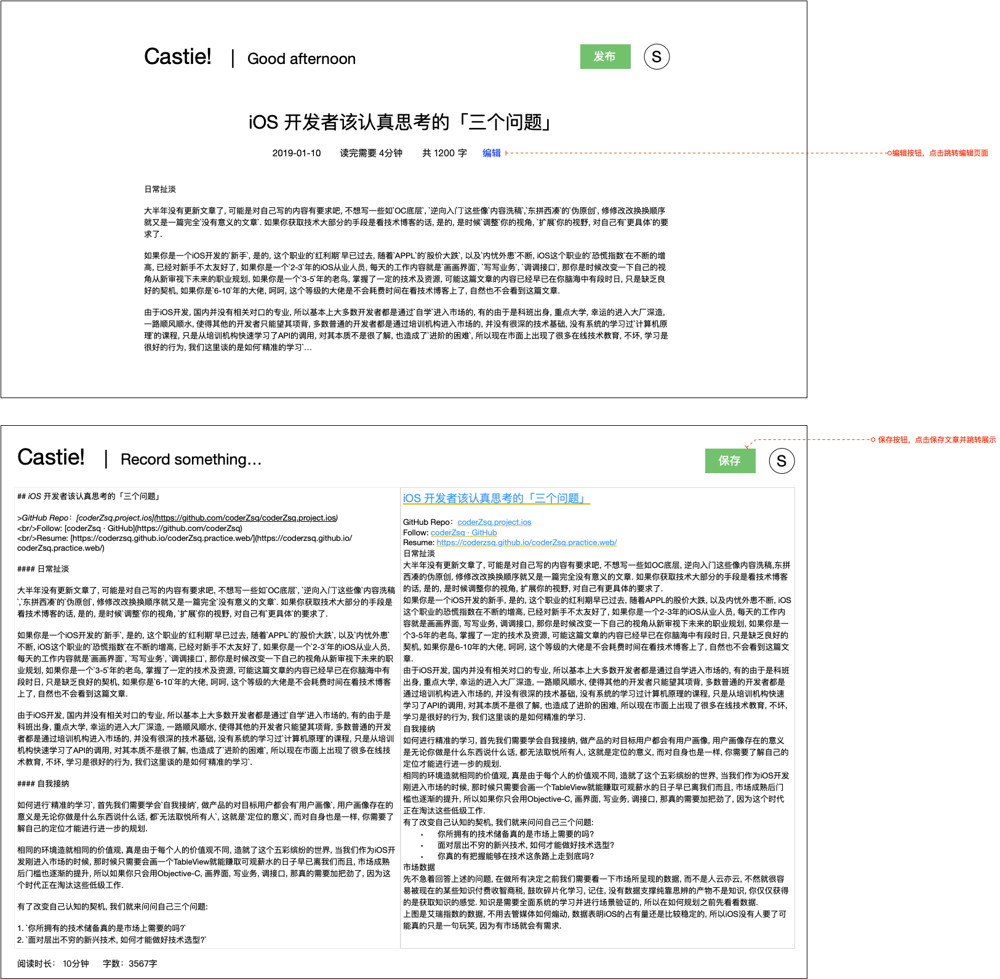

# UC03. 编辑文章

由朱双泉创建, 最后修改于四月 28, 2021

## 文档变更历史

| 版本 |   日期    | 负责人 | 说明 |
| :--: | :-------: | :----: | :--: |
|  v1  | 2021.4.28 | 朱双泉 | 创建 |

## 用例描述

本文档描述用户进入网站编辑文章

## 角色

- 用户

## 状态图

- 无

## 活动图

## 原型图

## 基本流程

1. 用例开始
2. 用户向系统发起编辑请求
3. 系统展示编辑界面
4. 用户进行文章的编辑
5. 用户进行文章的保存
6. 系统跳转该篇文章的文章详情页
7. 用例结束
